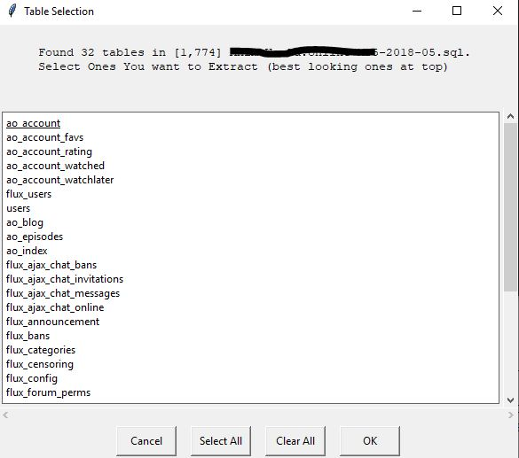

What is this?
-------------
These functions were born out of need to parse large SQL dumps from breached databases and extract meaningful data. Added a few more functions to deal with multiple SQL dump types (dirty and badly formatted ones included), and convert Excel files, HTML tables and "pretty printed" tables to CSV. Also added functions to clean the CSVs once they have been created in order to get rid of "useless" data.
For each conversion options, can convert single file, folder of files, or do recursive search that will convert all files in all subfolders.

SQL Dump Parsing
-------------
Will take pretty much any SQL dump you can throw at it and convert the dump to a CSV. Will work on dumps regardless if entries are line separated, if there are no proper tables, or on files without field values, etc.
If it is proper SQL dump with tables, the parser will first run through the file and identify any tables present. It will then produce a simple GUI from which you can select the tables you want to grab with the most "promising" ones listed at the top:
<pre><code> <br></code></pre>

<p>You also have the option to automatically grab all tables in a SQL file by adding the "dumpall" flag. If there is only one table found in the dump, script will just automatically begin dumping that table. 
Tables that have fields like "email","username","ipaddress" etc. will be seperated into folder called "good ones", in case you plan on dumping thousands of tables at a time.

Other Leaked DB File Conversions
-------------
* can convert every sheet in Excel file to seperate CSV sheets
* converts HTML tables to CSVs
* converts "pretty tables" to CSV, e.g. these guys
```
+-----------+------+------------+-----------------+
| City name | Area | Population | Annual Rainfall |
+-----------+------+------------+-----------------+
|  Adelaide | 1295 |  1158259   |      600.5      |
|  Brisbane | 5905 |  1857594   |      1146.4     |
+-----------+------+------------+-----------------+
```

Other Options
-------------
If you just want to extract email addresses from the file you can do that too with the extractemailsonly flag.
Can also choose to just extract emails from the file if you like.

Post Processing
-------------
Added ability to "clean" the resulting CSV files to get rid of useless fields as well as to normalize certain fields. For instance if it identifies date in 5 digit format it will convert to proper date. Or if sees IP address as integer or hex, will convert to IP address in format XXX.XX.XX.X.
Added bunch of names and conditions for columns that are usually useless, but feel free to change the conditions/columns as you like. Or don't use it.

Installation and Requirements
-------------
* Clone or download to machine
* install requirements from file

<b>Note:</b> Tested ONLY on Python 3.7.3 and on Windows 10.

Usage
-------------
```
usage: sqlparserplus.py [-h] [--sqlextract] [--emailsonly] [--html]
                        [--xltocsv] [--pretty] [--dumpall] [--encoding]
                        [--clean] [--cleandir] [--recursive]

optional arguments:
  -h, --help           show this help message and exit
  --recursive, -r      Use to convert/clean files within subfolders

What Do you Want to convert?:
  --sqlextract , -s    convert SQL file or folder of files to CSV
  --emailsonly , -em   only extract emails from file
  --html , -html       convert file with HTML tables to CSVs
  --xltocsv , -xl      converts each sheet of Excel file to CSV file - throw
                       in file or folder
  --pretty , -pt       converts 'pretty table' dump to CSV

SQL Dump Options:
  --dumpall, -d        grab and convert every table
  --encoding, -e       add flag if want to specify encoding. Best not to at
                       first.

Post Processing Options:
  --clean , -c         clean a CSV
  --cleandir , -cd     clean a directory of CSVs
  ```
